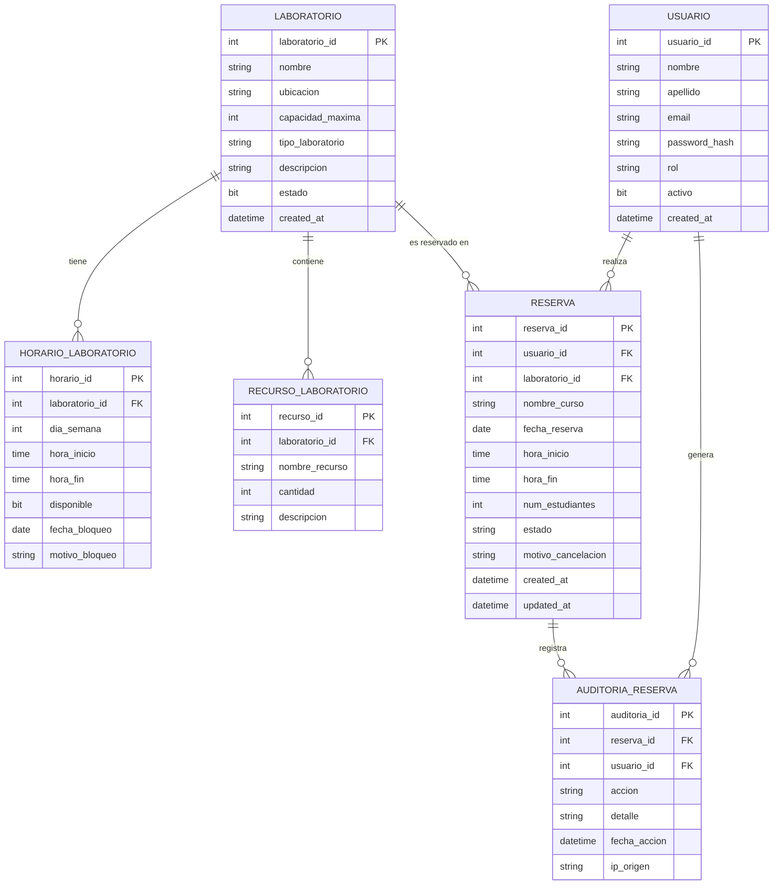

# Diagrama Entidad-Relación

Sistema de Reservas de Laboratorios Universitarios

```mermaid
erDiagram
  USUARIO {
    int usuario_id PK
    string nombre
    string apellido
    string email
    string password_hash
    string rol
    bit activo
    datetime created_at
  }
  LABORATORIO {
    int laboratorio_id PK
    string nombre
    string ubicacion
    int capacidad_maxima
    string tipo_laboratorio
    string descripcion
    bit estado
    datetime created_at
  }
  HORARIO_LABORATORIO {
    int horario_id PK
    int laboratorio_id FK
    int dia_semana
    time hora_inicio
    time hora_fin
    bit disponible
    date fecha_bloqueo
    string motivo_bloqueo
  }
  RECURSO_LABORATORIO {
    int recurso_id PK
    int laboratorio_id FK
    string nombre_recurso
    int cantidad
    string descripcion
  }
  RESERVA {
    int reserva_id PK
    int usuario_id FK
    int laboratorio_id FK
    string nombre_curso
    date fecha_reserva
    time hora_inicio
    time hora_fin
    int num_estudiantes
    string estado
    string motivo_cancelacion
    datetime created_at
    datetime updated_at
  }
  AUDITORIA_RESERVA {
    int auditoria_id PK
    int reserva_id FK
    int usuario_id FK
    string accion
    string detalle
    datetime fecha_accion
    string ip_origen
  }

  USUARIO ||--o{ RESERVA : "realiza"
  USUARIO ||--o{ AUDITORIA_RESERVA : "genera"
  LABORATORIO ||--o{ HORARIO_LABORATORIO : "tiene"
  LABORATORIO ||--o{ RECURSO_LABORATORIO : "contiene"
  LABORATORIO ||--o{ RESERVA : "es reservado en"
  RESERVA ||--o{ AUDITORIA_RESERVA : "registra"
```