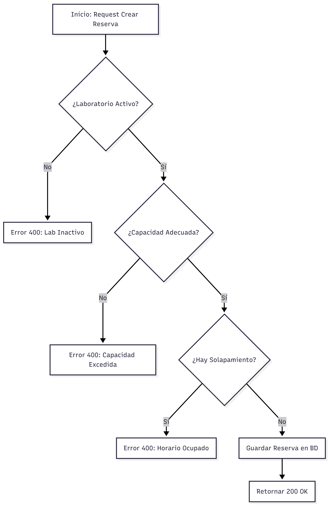
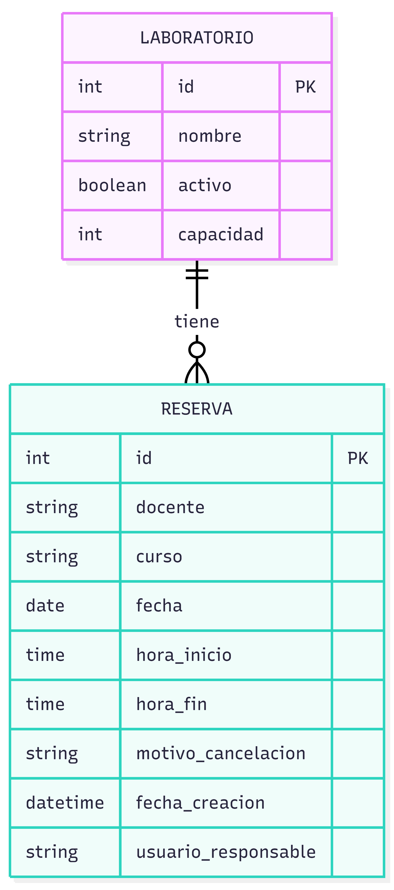
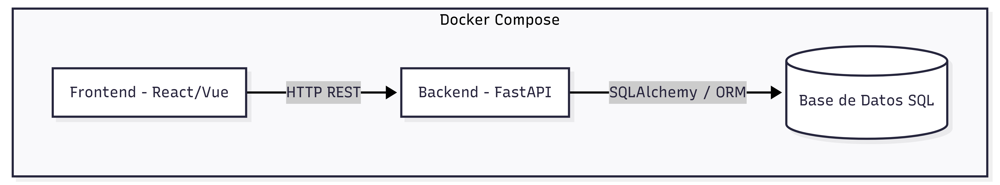

# Módulo: Gestión de Reservas

## 1. Diagramas del Sistema

### Diagrama de Secuencia (Flujo de Creación)

### Modelo Entidad-Relación

### Arquitectura de Componentes

---

## 2. Documentación de Endpoints (API)

### Crear Reserva (`POST /reservas`)
- **Descripción**: Crea una reserva validando estrictamente que el laboratorio esté activo, la capacidad sea adecuada y no existan solapamientos de horario.
- **Campos Obligatorios**: Docente, Curso, Fecha, Hora inicio y Hora fin.
- **Respuestas**:
  - `200 OK`: Reserva creada exitosamente con sus campos de auditoría (fecha de creación y responsable).
  - `400 Bad Request`: Falla en alguna de las validaciones de negocio.

### Cancelar Reserva (`POST /reservas/{id}/cancelar`)
- **Descripción**: Cancela una reserva activa.
- **Validación Crítica**: Exige obligatoriamente el campo `motivo_cancelacion` en el cuerpo de la petición.

### Reprogramar Reserva (`PUT /reservas/{id}/reprogramar`)
- **Descripción**: Actualiza los horarios de una reserva. Vuelve a ejecutar todas las validaciones de solapamiento y capacidad con los nuevos datos.

### Historial y Auditoría (`GET /reservas/historial`)
- **Descripción**: Permite consultar el historial de las reservas.
- **Filtros Soportados**: Búsqueda por Laboratorio específico y por Periodo Académico.