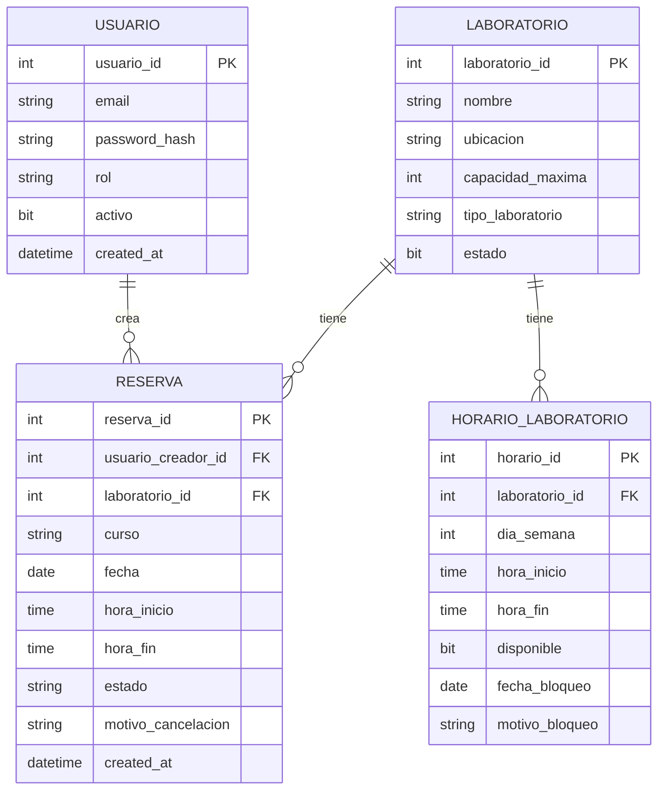
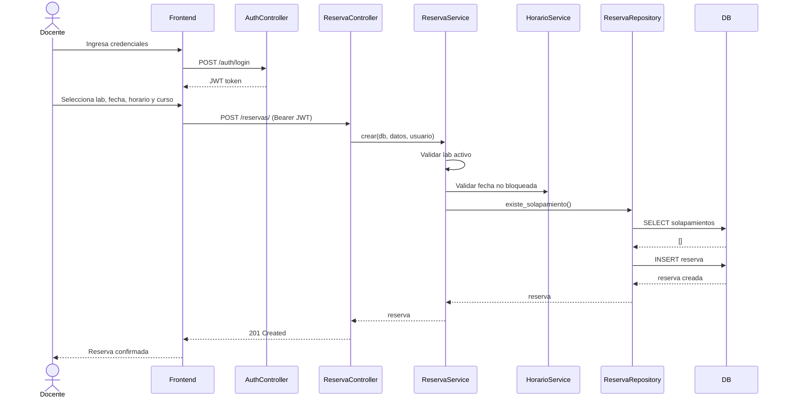
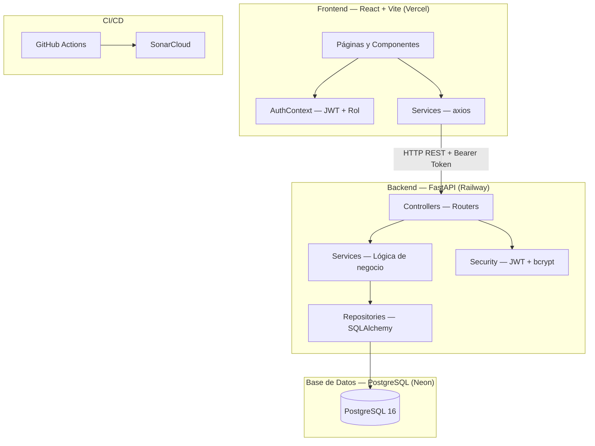

# Wiki — Sistema de Reservas de Laboratorios Universitarios

## Tabla de contenidos
1. [Contexto del problema](#contexto-del-problema)
2. [Usuario final](#usuario-final)
3. [Caso de uso principal](#caso-de-uso-principal)
4. [Alcance del proyecto](#alcance-del-proyecto)
5. [Guía de ejecución](#guía-de-ejecución)
6. [Casos de prueba y evidencias](#casos-de-prueba-y-evidencias)
7. [API REST documentada](#api-rest-documentada)
8. [Diagramas](#diagramas)
9. [Diseño de pantallas](#diseño-de-pantallas)
10. [Monetización](#monetización)
11. [Estrategia de visibilidad](#estrategia-de-visibilidad)
12. [Riesgos y mitigaciones](#riesgos-y-mitigaciones)
13. [Estudio de mercado](#estudio-de-mercado)
14. [Roadmap y mejoras futuras](#roadmap-y-mejoras-futuras)

---

## Contexto del problema

Una universidad con múltiples programas académicos presenta conflictos frecuentes en la asignación de laboratorios especializados (informática, electrónica, química y multimedia). Las reservas se gestionan mediante correos electrónicos y hojas de cálculo, generando:

- Solapamientos de horarios
- Baja trazabilidad de uso
- Dificultad para medir la utilización real
- Imposibilidad de generar reportes estadísticos

El sistema centraliza la gestión de disponibilidad, reservas, control de horarios y generación de reportes que apoyen la planeación académica.

---

## Usuario final

| Rol | Descripción |
|---|---|
| **Administrador** | Gestiona todo el sistema, usuarios y configuración |
| **Coordinador Académico** | Gestiona laboratorios, horarios y genera reportes |
| **Docente** | Crea, cancela y reprograma sus propias reservas |
| **Consulta** | Solo puede consultar disponibilidad y horarios |

---

## Caso de uso principal

**Reservar un laboratorio:**

1. El docente inicia sesión con sus credenciales
2. Consulta la disponibilidad de laboratorios por fecha y hora
3. Selecciona el laboratorio y el horario disponible
4. Crea la reserva indicando curso y número de estudiantes
5. El sistema valida que no haya solapamiento ni supere la capacidad
6. La reserva queda confirmada y se registra en auditoría
7. El docente puede cancelar o reprogramar con motivo

---

## Alcance del proyecto

### Incluye
- CRUD completo de laboratorios
- Configuración de horarios disponibles por laboratorio
- Bloqueo de fechas especiales (mantenimiento, festivos)
- Gestión de reservas con validaciones de negocio
- Control de acceso por roles (JWT)
- Historial y auditoría de cambios
- Reportes de uso por laboratorio, docente y periodo
- Exportación CSV/PDF
- API REST documentada con Swagger
- Pruebas unitarias con cobertura ≥ 60%
- Dockerización completa
- CI/CD con GitHub Actions
- Análisis de calidad con SonarQube

### No incluye
- Aplicación móvil nativa
- Integración con sistema académico externo
- Notificaciones por email/SMS
- Pagos o facturación

### Supuestos técnicos
- Los laboratorios ya existen físicamente en la universidad
- Un docente solo puede tener una reserva activa por horario
- La capacidad máxima del laboratorio es un límite estricto

---

## Guía de ejecución

### Prerrequisitos

- Docker Desktop
- Python 3.11
- Node.js 18+
- Git

### Variables de entorno

Copiar `.env.example` a `.env` y completar:

| Variable | Descripción |
|---|---|
| `DB_SERVER` | `db` (Docker) o `localhost` (local) |
| `DB_PORT` | `5432` |
| `DB_USER` | `postgres` |
| `DB_PASSWORD` | Contraseña de la BD |
| `DB_NAME` | `reservas` |
| `JWT_SECRET_KEY` | Clave secreta mínimo 32 caracteres |
| `APP_ENV` | `development` o `production` |
| `CORS_ORIGIN` | URL del frontend (`http://localhost:5173`) |
| `SEED_EMAIL` | Email del primer admin |
| `SEED_PASSWORD` | Contraseña del primer admin |

### Levantar con Docker (recomendado)

```bash
# 1. Levantar BD + backend
docker-compose up --build

# 2. En otra terminal — crear usuario admin (solo primera vez)
docker exec -e SEED_EMAIL="admin@uni.edu" -e SEED_PASSWORD="Admin123!" reservas_backend python seed.py

# 3. Frontend (desarrollo)
cd frontend && npm install && npm run dev
```

### Ejecutar pruebas

```bash
cd backend

# Pruebas unitarias e integración
pytest tests/ --ignore=tests/load --ignore=tests/stress -v

# Con cobertura
pytest tests/ --ignore=tests/load --ignore=tests/stress --cov=app --cov-report=term-missing

# Solo smoke
pytest tests/smoke/ -m smoke -v

# E2E con Playwright (desde raíz, backend debe estar corriendo)
npx playwright test

# Carga con Locust
locust -f tests/load/locustfile.py --host=http://localhost:8000
```

---

## Casos de prueba y evidencias

### Módulo Gestión de Horarios

| ID | Descripción | Tipo | Resultado |
|---|---|---|---|
| TC-H01 | Crear horario con laboratorio activo | Positivo |  Pasa |
| TC-H02 | Crear horario con laboratorio inexistente | Negativo |  Pasa |
| TC-H03 | Crear horario con laboratorio inactivo | Negativo |  Pasa |
| TC-H04 | Crear horario duplicado mismo día | Negativo |  Pasa |
| TC-H05 | Bloquear fecha especial exitosamente | Positivo |  Pasa |
| TC-H06 | Bloquear fecha ya bloqueada | Negativo |  Pasa |
| TC-H07 | Desbloquear horario bloqueado | Positivo |  Pasa |
| TC-H08 | Desbloquear horario ya disponible | Negativo |  Pasa |
| TC-H09 | Listar horarios de laboratorio activo | Positivo |  Pasa |
| TC-H10 | Listar horarios de laboratorio inexistente | Negativo |  Pasa |

### Módulo Gestión de Laboratorios

| ID | Descripción | Tipo | Resultado |
|---|---|---|---|
| TC-L01 | Obtener todos los laboratorios | Positivo | Pasa |
| TC-L02 | Obtener laboratorio por ID existente | Positivo | Pasa |
| TC-L03 | Obtener laboratorio por ID inexistente | Negativo | Pasa |
| TC-L04 | Crear laboratorio con datos válidos | Positivo |  Pasa |
| TC-L05 | Crear laboratorio sin recursos | Positivo |  Pasa |
| TC-L06 | Actualizar nombre de laboratorio | Positivo |  Pasa |
| TC-L07 | Actualizar laboratorio inexistente | Negativo |  Pasa |
| TC-L08 | Desactivar laboratorio existente | Positivo |  Pasa |

### Módulo Autenticación y Usuarios

| ID | Descripción | Tipo | Resultado |
|---|---|---|---|
| TC-A01 | Login con credenciales válidas retorna JWT | Positivo | Pasa |
| TC-A02 | Login con email inexistente retorna 401 | Negativo | Pasa |
| TC-A03 | Login con contraseña incorrecta retorna 401 | Negativo | Pasa |
| TC-A04 | Registrar usuario como ADMIN exitosamente | Positivo | Pasa |
| TC-A05 | Registrar usuario con email duplicado retorna 400 | Negativo | Pasa |
| TC-A06 | Registrar usuario sin rol ADMIN retorna 403 | Negativo | Pasa |
| TC-A07 | Obtener perfil propio con token válido | Positivo | Pasa |
| TC-A08 | Acceder a endpoint protegido sin token retorna 401 | Negativo | Pasa |

### Módulo Gestión de Reservas

| ID | Descripción | Tipo | Resultado |
|---|---|---|---|
| TC-R01 | Crear reserva con datos válidos | Positivo | Pasa |
| TC-R02 | Crear reserva con solapamiento retorna 409 | Negativo | Pasa |
| TC-R03 | Crear reserva en laboratorio inactivo retorna 422 | Negativo | Pasa |
| TC-R04 | Crear reserva en fecha bloqueada retorna 422 | Negativo | Pasa |
| TC-R05 | Cancelar reserva activa con motivo | Positivo | Pasa |
| TC-R06 | Cancelar reserva sin motivo retorna 422 | Negativo | Pasa |
| TC-R07 | Listar reservas propias del docente | Positivo | Pasa |
| TC-R08 | Obtener reserva por ID existente | Positivo | Pasa |
| TC-R09 | Obtener reserva por ID inexistente retorna 404 | Negativo | Pasa |

### Módulo Reportes

| ID | Descripción | Tipo | Resultado |
|---|---|---|---|
| TC-RE01 | Generar reporte de uso por laboratorio | Positivo | Pasa |
| TC-RE02 | Generar reporte de uso con filtro de fechas | Positivo | Pasa |
| TC-RE03 | Generar reporte de ocupación mensual | Positivo | Pasa |
| TC-RE04 | Generar reporte por docente | Positivo | Pasa |
| TC-RE05 | Exportar reporte de uso en CSV | Positivo | Pasa |
| TC-RE06 | Acceder a reportes como DOCENTE retorna 403 | Negativo | Pasa |

### Resumen de cobertura

| Módulo | Pruebas | Cobertura |
|---|---|---|
| auth_service | 15 | 92% |
| reserva_service | 18 | 88% |
| reporte_service | 12 | 85% |
| horario_service | 20 | 79% |
| laboratorio_service | 17 | 100% |
| horario_repository | 10 | 100% |
| laboratorio_repository | 6 | 100% |
| **Total** | **135** | **87%** |

---

## API REST documentada

La documentación completa está disponible en Swagger UI al levantar el proyecto:

**Local:** http://localhost:8000/docs

### Endpoints principales

#### Horarios
| Método | Endpoint | Descripción | Auth |
|---|---|---|---|
| POST | /horarios/ | Crear horario disponible | Admin, Coordinador |
| GET | /horarios/laboratorio/{id} | Listar horarios de un laboratorio | Todos |
| GET | /horarios/{id} | Obtener horario por ID | Todos |
| PUT | /horarios/{id} | Actualizar horario | Admin, Coordinador |
| PATCH | /horarios/{id}/bloquear | Bloquear fecha especial | Admin, Coordinador |
| PATCH | /horarios/{id}/disponible | Desbloquear horario | Admin, Coordinador |

#### Laboratorios
| Método | Endpoint | Descripción | Auth |
|---|---|---|---|
| GET | /laboratorios/ | Listar laboratorios | Todos |
| POST | /laboratorios/ | Crear laboratorio | Admin, Coordinador |
| GET | /laboratorios/{id} | Obtener laboratorio | Todos |
| PUT | /laboratorios/{id} | Actualizar laboratorio | Admin, Coordinador |
| DELETE | /laboratorios/{id} | Desactivar laboratorio | Admin |

#### Reservas
| Método | Endpoint | Descripción | Auth |
|---|---|---|---|
| POST | /reservas/ | Crear reserva | Docente, Admin, Coordinador |
| GET | /reservas/ | Listar reservas propias | Autenticado |
| GET | /reservas/{id} | Obtener reserva por ID | Autenticado |
| PATCH | /reservas/{id}/cancelar | Cancelar reserva con motivo | Autenticado |

#### Autenticación y Usuarios
| Método | Endpoint | Descripción | Auth |
|---|---|---|---|
| POST | /auth/login | Iniciar sesión — retorna JWT | Público |
| POST | /auth/register | Registrar nuevo usuario | Solo Admin |
| GET | /usuarios/ | Listar todos los usuarios | Solo Admin |
| GET | /usuarios/me | Perfil del usuario autenticado | Autenticado |

#### Reportes
| Método | Endpoint | Descripción | Auth |
|---|---|---|---|
| GET | /reportes/uso-laboratorio | Uso por laboratorio (con filtros de fecha) | Admin, Coordinador |
| GET | /reportes/ocupacion-mensual | Ocupación por mes y año | Admin, Coordinador |
| GET | /reportes/por-docente | Reservas agrupadas por docente | Admin, Coordinador |
| GET | /reportes/uso-laboratorio/csv | Exportar uso en CSV | Admin, Coordinador |
| GET | /reportes/por-docente/csv | Exportar reporte docente en CSV | Admin, Coordinador |

---

## Diagramas

### Diagrama Entidad-Relación



### Diagrama de Secuencia — Flujo principal (crear reserva)



### Diagrama de Componentes



---

## Diseño de pantallas

Los mockups del sistema están disponibles en Figma. Las pantallas diseñadas cubren el flujo principal:

| Pantalla | Descripción |
|---|---|
| Login | Formulario de acceso con email y contraseña |
| Laboratorios | Listado de laboratorios disponibles con estado y capacidad |
| Nueva reserva | Selección de lab, fecha, franja horaria y curso |
| Historial | Tabla de reservas con filtro por estado y opción de cancelar |
| Reportes | Tres pestañas: uso por lab, ocupación mensual, por docente — exportación CSV |
| Gestión de usuarios | Panel exclusivo ADMIN: lista de usuarios y creación de nuevos |

> El sistema implementa navegación condicional por rol: los usuarios DOCENTE no ven Reportes ni Usuarios; los ADMIN tienen acceso completo.

---

## Monetización

Para mantener la aplicación activa se proponen los siguientes modelos:

| Modelo | Descripción |
|---|---|
| **SaaS institucional** | Licencia anual por universidad — precio según número de laboratorios |
| **Freemium** | Hasta 5 laboratorios gratis, pago por funciones avanzadas (reportes, exportación) |
| **Soporte y mantenimiento** | Contrato de soporte técnico mensual por institución |
| **Implementación** | Cobro por instalación, configuración e integración con sistemas existentes |

---

## Estrategia de visibilidad

- Presentación en ferias académicas y congresos de tecnología educativa
- Alianzas con universidades piloto para casos de éxito
- Publicación en repositorios académicos y GitHub
- Demo pública accesible desde URL producción
- Documentación completa en GitHub Wiki
- SEO enfocado en términos como "sistema reservas laboratorios universitarios"

---

## Riesgos y mitigaciones

| Riesgo | Probabilidad | Impacto | Mitigación |
|---|---|---|---|
| Solapamiento de reservas por concurrencia | Media | Alto | Transacciones atómicas en BD + validación en service |
| Pérdida de datos | Baja | Alto | Backups automáticos de SQL Server + volúmenes Docker |
| Acceso no autorizado | Media | Alto | JWT + control de roles + HTTPS en producción |
| Baja adopción por docentes | Alta | Medio | UX simple + capacitación + guías de usuario |
| Caída del servidor en producción | Baja | Alto | Docker restart policy + monitoreo con alertas |
| Cambios en requerimientos | Media | Medio | Arquitectura por capas + roadmap definido |

---

## Estudio de mercado

### Sistemas similares existentes

| Sistema | Fortalezas | Diferencias con nuestro sistema |
|---|---|---|
| **EMS Campus** | Completo, integrado con ERP | Muy costoso, complejo de implementar |
| **Skedda** | Interfaz moderna, fácil uso | No especializado en laboratorios universitarios |
| **Resource Guru** | Buena gestión de recursos | No tiene control de roles académicos |
| **Google Calendar** | Gratuito, conocido | Sin validaciones de negocio ni reportes |
| **Hojas de cálculo** | Cero costo | Sin validaciones, solapamientos frecuentes |

### Diferenciadores de nuestro sistema
- Especializado en contexto universitario colombiano
- Control de roles académicos (Coordinador, Docente, Consulta)
- Validaciones de negocio específicas (capacidad, solapamiento, horarios)
- Open source y desplegable en nube o servidor propio
- Arquitectura moderna (FastAPI + Docker) de bajo costo operativo
- Auditoría completa de todas las acciones

---

## Roadmap y mejoras futuras

### Versión 1.0 (actual)
- CRUD laboratorios, horarios y reservas
- Control de roles con JWT
- Auditoría de cambios
- API REST documentada
- Pruebas unitarias 90% cobertura
- Dockerización
- CI/CD con GitHub Actions

### Versión 1.1
- [ ] Notificaciones por email al crear/cancelar reserva
- [ ] Reportes exportables en PDF y CSV
- [ ] Dashboard con estadísticas de uso

### Versión 1.2
- [ ] Integración con calendario institucional
- [ ] App móvil (React Native)
- [ ] Reservas recurrentes (mismo laboratorio cada semana)

### Versión 2.0
- [ ] Integración con sistema académico (SIA)
- [ ] IA para sugerir horarios óptimos
- [ ] Multi-tenancy (varias universidades en una instancia)